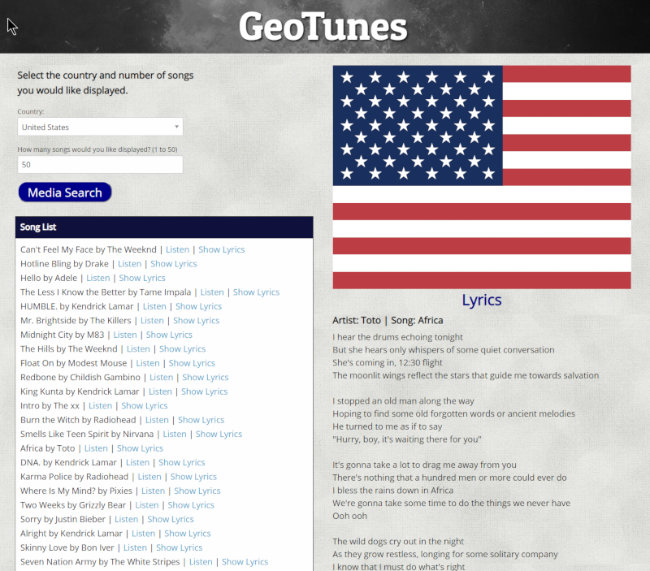

# GeoTunes

---

## [Deployed app](https://dirk-kiesewetter.github.io/GeoTunes/)

### Problems:

GeoTunes was created with the idea of using APIs to create a playlist based on geographic location. The user selects the country and the number of songs desired. Additionally, GeoTunes was to display lyrics for the songs of the playlist, as well as a video of the chosen song. User input validation was needed for the number of songs selected.

### Solutions:

- The LastFM API provides a way to get the current playlist of top songs based on country. Links to the video for the playlist songs are also provided by the LastFM API.
- The Lyrics.ovh API provides the user requested lyrics.
- user input validation was implemented using an if/else conditional to check for correct user input.

### Technical Details:

- LastFM & Lyrics.ovh APIs were used for the song data (playlist, lyrics, and videos).
- AJAX calls were used to access the APIs.
- The country flags are SVG graphics. SVGs are vector format, so the file size is small, and the images are infinitely scalable with no loss of image quality.
- jQuery was used for accessing & changing elements in the DOM.

---

GeoTunes was a group project. Below is the ReadMe from the group repository:

### Team

    Pauline (team lead)
    Dirk
    Joel
    Evan

### Project Details:

    GeoTunes allows users to choose a country and the number of songs to generate a list of the top tracks in that location. GeoTunes also displays the flag of the nation selected.
    Users can click on a link that directs them to listen to the song or to display the lyrics on the page.

APIs used:

- [last-fm](https://www.last.fm/api/)
- [lyrics.ovh](https://lyricsovh.docs.apiary.io/)
